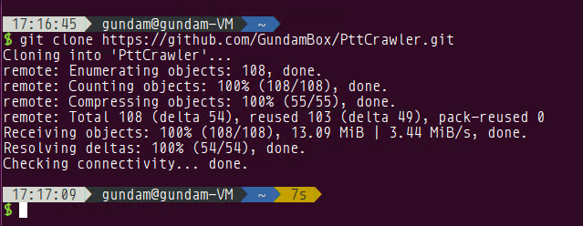
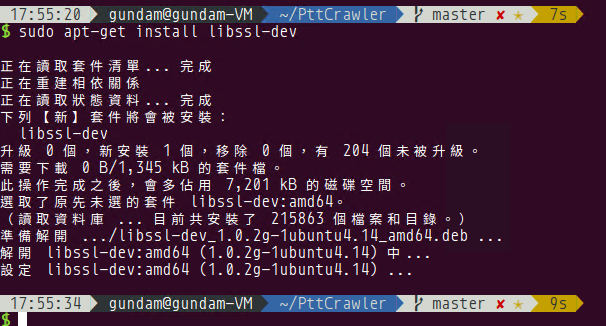

# PttCrawler

## Dependencies

* Python 3.x
* libssl-dev

## Installation

1. git clone

```bash
git clone https://github.com/GundamBox/PttCrawler.git
```



2. change directory

```bash
cd PttCrawler
```


3. Check Python and Pip Version

Must use Python3

```bash
sudo apt-get install python3 python3-pip
```


4. Install Package

```bash
sudo apt-get install libssl-dev
sudo pip3 install -r requirements.txt 
```




5. Copy `config_example.ini` as `config.ini`

```bash
cp config_example.ini config.ini
```


6. Upgrade SQLite Database

```bash
alembic upgrade head
```

## Configuration

```ini
[Database]
# Database Url: [Type]://[Name]
# Currently only support SQLite
Type = sqlite
Name = ptt.db

[PttUser]
# term.ptt.cc every action delaytime
Delaytime = 2
# selenium webdriver folder
WebdriverFolder = webdriver
# term.ptt.cc bot login id/password
UserId = guest
UserPwd = guest
# Choices = {database, json, both}
Output = both

[PttArticle]
# Delaytime: delay time for each article
# NextPageDelaytime: delay time for each index
Delaytime = 2.0
NextPageDelaytime = 10.0
# request timeout
Timeout = 10
# Choices = {database, json, both}
Output = both
# The article history keeps at most 30 versions.
```

## Usage

### Inintialize Database

```bash
python init_db.py
```

### Crawler

1. PTT Article index

    ```bash
    python -m crawler article_index --board-name BOARD_NAME \
        [--before | --after] [--index INDEX]                 
    ```

2. PTT Article

    ```bash
    python -m crawler article --board-name BOARD_NAME \
        (--start-date | --index START_INDEX END_INDEX | --database) \
        (--add | --upgrade) \
        [--config-path CONFIG_PATH]
    ```

3. PTT User last login record

    ```bash
    python -m crawler user (--database | --id ID) [--config-path CONFIG_PATH]
    ```

4. PTT Ip autonomous system number

    ```bash
    python -m crawler asn (--database | --ip IP) [--config-path CONFIG_PATH]
    ```

### Export

Export in file with ods, csv or json file format

```bash
python export.py --format {ods, csv, json} --output-folder OUTPUT_FOLDER [--output-prefix OUTPUT_PREFIX]
```

### Schedule

1. Update

```bash
python schedule.py update {article, asn, user} -c CYCLE_TIME [-s START_DATETIME] [--virtualenv VIRTUALENV_PATH]
```

2. Remove

```bash
python schedule.py remove {article, asn, user}
```

## Bundle python scripts into executables

### Bundle instruction

* windows

    ```bash
    # init_db.exe
    pyinstaller -F --clean ^
        --hidden-import logging.config ^
        --hidden-import typing ^
        --hidden-import sqlalchemy.ext.declarative ^
        init_db.py

    # export.exe
    pyinstaller -F --clean ^
        --hidden-import pyexcel_io.readers ^
        --hidden-import pyexcel_io.writers ^
        --hidden-import pyexcel_io.database ^ 
        --hidden-import pyexcel_ods3.odsw ^
        --hidden-import sqlalchemy.ext.baked ^
        export.py

    # query.exe
    pyinstaller -F --clean ^
        --hidden-import pyexcel_io.readers ^
        --hidden-import pyexcel_io.writers ^
        --hidden-import pyexcel_io.database ^
        --hidden-import pyexcel_ods3.odsw ^
        --hidden-import sqlalchemy.ext.baked ^
        query.py

    # schedule.exe
    # `python-crontab` is not working on windows
    # Todo: search other package to replace `python-crontab`
    pyinstaller -F --clean ^
        schedule.py

    # crawler.exe
    pyinstaller -F --clean ^
        --hidden-import sqlalchemy.ext.baked ^
        --name crawler.exe ^
        crawler\__main__.py 
    ```

* linux 

    ```bash
    # init_db
    pyinstaller -F --clean \
        --hidden-import logging.config \
        --hidden-import typing \
        --hidden-import sqlalchemy.ext.declarative \
        init_db.py

    # export
    pyinstaller -F --clean \
        --hidden-import pyexcel_io.readers \
        --hidden-import pyexcel_io.writers \
        --hidden-import pyexcel_io.database \
        --hidden-import pyexcel_ods3.odsw \
        --hidden-import sqlalchemy.ext.baked \
        export.py

    # query
    pyinstaller -F --clean \
        --hidden-import pyexcel_io.readers \
        --hidden-import pyexcel_io.writers \
        --hidden-import pyexcel_io.database \
        --hidden-import pyexcel_ods3.odsw \
        --hidden-import sqlalchemy.ext.baked \
        query.py

    # schedule
    pyinstaller -F --clean \
        schedule.py

    # crawler
    pyinstaller -F --clean \
        --hidden-import sqlalchemy.ext.baked \
        --name crawler \
        crawler/__main__.py 
    ```


## Architecture

```
PttCrawler/
├── CHANGELOG.md
├── config_example.ini
├── init_db.py
├── crawler/
│   ├── __init__.py
│   ├── __main__.py
│   ├── crawler_arg.py
│   ├── article_index.py
│   ├── article.py
│   ├── asn.py
│   └── user.py
├── db_migration/
│   ├── env.py
│   ├── README
│   ├── script.py.mako
│   └── versions/
│       ├── 77eaebfa8062_create_initial_table.py
│       ├── 64f93945c28a_edit_article_table.py
│       ├── 6794412e2720_edit_article_history_on_delete_actions.py
|       └── 3af39c6792c0_edit_datetime_nullable.py
├── doc/
│   ├── img/
│   ├── en.md
│   └── zh.md
├── models/
│   ├── __init__.py
│   ├── base.py
│   ├── article.py
│   ├── asn.py
│   └── user.py
│── webdriver/
├── env_wrapper.sh
├── export.py
├── query.py
├── schedule.py
├── utils.py
├── requirements.txt
└── README.md
```