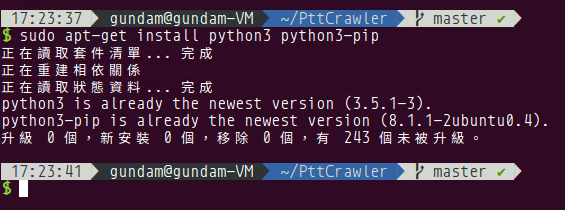

# PttCrawler

## 相依性

* Python 3.x
* libssl-dev

## 安裝

1. git clone

```bash
git clone https://github.com/GundamBox/PttCrawler.git
```


2. change directory

```bash
cd PttCrawler
```


3. Check Python and Pip Version

必須是 Python3

```bash
sudo apt-get install python3 python3-pip
```



4. Install Package

```bash
sudo apt-get install libssl-dev
sudo pip3 install -r requirements.txt 
```


5. 複製`config_example.ini`為`config.ini`

```bash
cp config_example.ini config.ini
```


## 設定

```ini
[Database]
# Database Url: [Type]://[Name]
# 目前只支援SQLite
Type = sqlite
Name = ptt.db

[PttUser]
# term.ptt.cc 每個動作的間隔
Delaytime = 2
# selenium 需要用到的webdriver的資料夾
WebdriverFolder = webdriver
# term.ptt.cc 的 登入帳號密碼
UserId = guest
UserPwd = guest
# Choices = {database, json, both}
Output = both

[PttArticle]
# Delaytime 是每篇文章之間的Delaytime
# NextPageDelaytime 是WebPtt索引頁之間的Delaytime
Delaytime = 2.0
NextPageDelaytime = 10.0
# request timeout
Timeout = 10
# Choices = {database, json, both}
Output = both
# 文章歷史紀錄頂多保留30個版本
VersionRotate = 30
```

## 使用

### Crawler

1. PTT 文章索引爬蟲

    從WebPtt爬取文章索引

    * --board-name
        - 看板名稱
    * --before, --after
        - 預設為before
        - before是往舊索引爬取
        - after是往新索引爬取
    * --index 
        - 若前面設定為before, 預設為DB中最舊的索引
        - 若前面設定為after, 預設為DB中最新的索引
        - 若DB無資料, 預設到該看板抓取最新的索引

    ```bash
    python -m crawler article_index --board-name BOARD_NAME \
        [--before | --after] [--index INDEX]                 
    ```

2. PTT 文章爬蟲

    從WebPtt爬取文章

    * --board-name
        - 看板名稱
    * --start-date, --index, --database
        - --start-date: 從最新文章往前爬取到特定時間的文章
        - --index: 爬取從START_INDEX到END_INDEX之間的文章
        - --database: 爬取DB中有紀錄索引的文章
    * --add, --upgrade
        - --add 會跳過存在的舊文章, 不新增文章歷史紀錄
        - --upgrade 每個文章都會新增一個歷史紀錄

    ```bash
    python -m crawler article --board-name BOARD_NAME \
        (--start-date | --index START_INDEX END_INDEX | --database) \
        (--add | --upgrade) \
        [--config-path CONFIG_PATH]
    ```

3. PTT 鄉民上站紀錄爬蟲

    利用term.ptt.cc爬取上站紀錄、登入次數、有效文章

    ```bash
    python -m crawler user (--database | --id ID) [--config-path CONFIG_PATH]
    ```

4. PTT 查Ip Autonomous System Number

    查Ip的ASN(主要查Country code)

    ```bash
    python -m crawler asn (--database | --ip IP) [--config-path CONFIG_PATH]
    ```

### Export

匯出成ods或csv

```bash
python export.py --format {ods, csv} --output-folder OUTPUT_FOLDER [--output-prefix OUTPUT_PREFIX]
```

### Schedule

1. Update

    - --args
        * crawler的參數
        * 例如: `python schedule.py update article_index --args "--board-name Gossiping" -c 1`
    - -c
        * 循環天數間隔

    ```bash
    python schedule.py update {article_index, article, asn, user} \
        --args ARGS
        -c CYCLE_TIME [-s START_DATETIME] [--virtualenv VIRTUALENV_PATH]
    ```

2. Remove

    - --args
        * crawler的參數
        * 例如: `python schedule.py remove article_index --args "--board-name GUNDAM"`

    ```bash
    python schedule.py remove {article_index, article, asn, user} --args ARGS
    ```

## 檔案結構

```
PttCrawler/
├── CHANGELOG.md
├── config_example.ini
├── crawler/
│   ├── __init__.py
│   ├── __main__.py
│   ├── crawler_arg.py
│   ├── article_index.py
│   ├── article.py
│   ├── asn.py
│   └── user.py
├── db_migration/
│   ├── env.py
│   ├── README
│   ├── script.py.mako
│   └── versions/
│       ├── 77eaebfa8062_create_initial_table.py
│       ├── 64f93945c28a_edit_article_table.py
│       └── 6794412e2720_edit_article_history_on_delete_actions.py
├── doc/
│   ├── img/
│   ├── en.md
│   └── zh.md
├── models/
│   ├── __init__.py
│   ├── base.py
│   ├── article.py
│   ├── asn.py
│   └── user.py
│── webdriver/
├── env_wrapper.sh
├── export.py
├── query.py
├── schedule.py
├── utils.py
├── requirements.txt
└── README.md
```